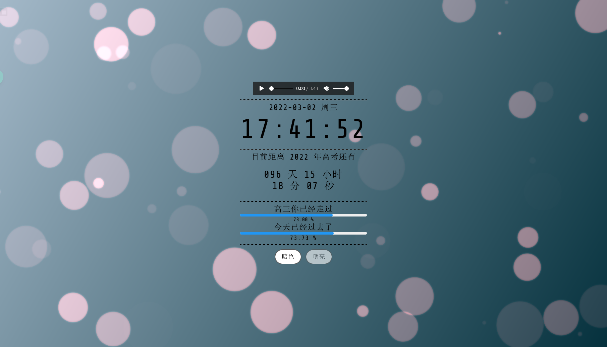
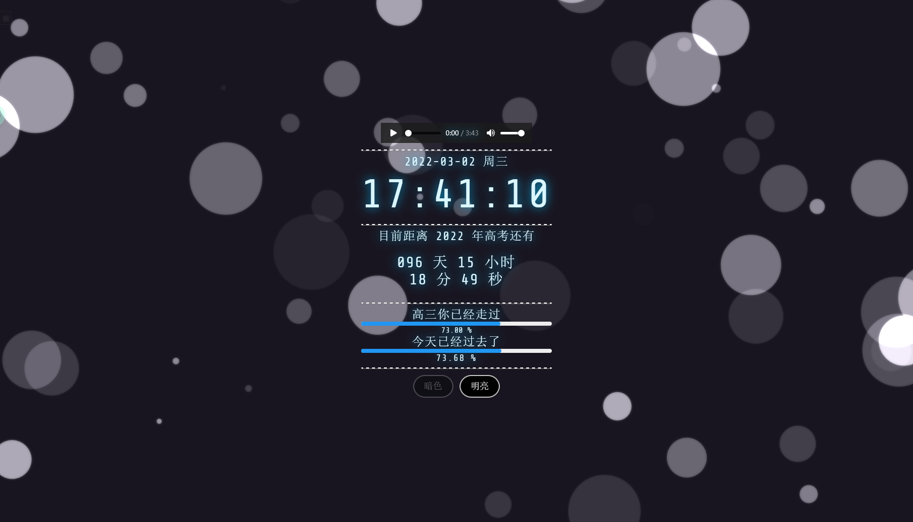

[Documentation]:https://img.shields.io/badge/-示例(可点)-blue.svg?logo=Wikipedia&style=for-the-badge&logoColor=black

# 高考倒计时

[![Documentation]](https://tartaros.fun/GaoKao)
- 添加了背景的斑点
- 添加了高三倒计时
- 适配了手机
- 黑夜模式为默认
- 添加了一个[音乐](https://music.163.com/song?id=1385176005)

## 实现参考

进度条采用: [vue-simple-progress](https://github.com/dzwillia/vue-simple-progress)

Digital Clock 和大体的 CSS  是从 [Digital Clock with Vue.js - Toshiyuki TAKAHASH](https://codepen.io/gau/pen/LjQwGp) 处剽窃过来的

高考倒计时的实现参考了 [MicDZ的文章](https://www.micdz.cn/article/time/)

## 演示案例
- 更改

- 原来长这样

